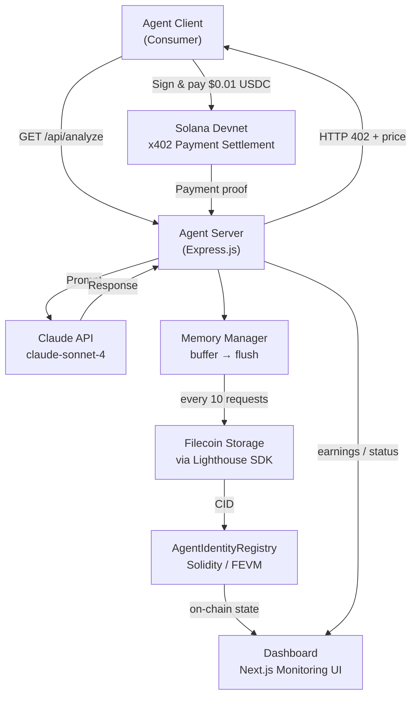
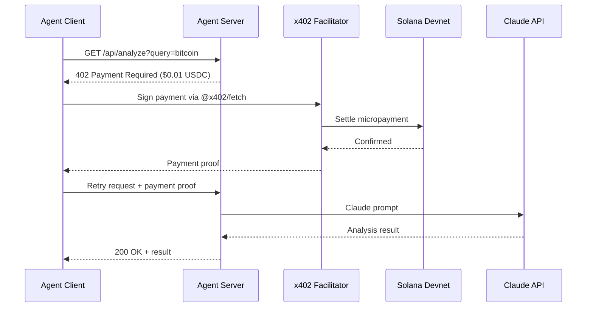
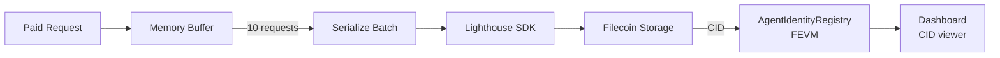
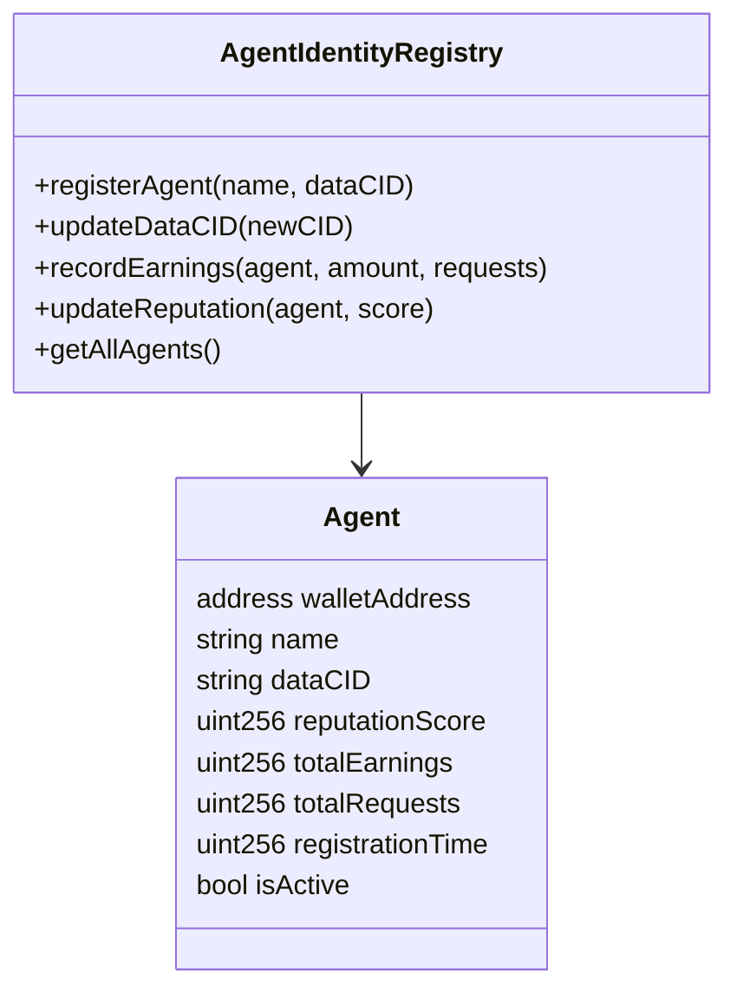
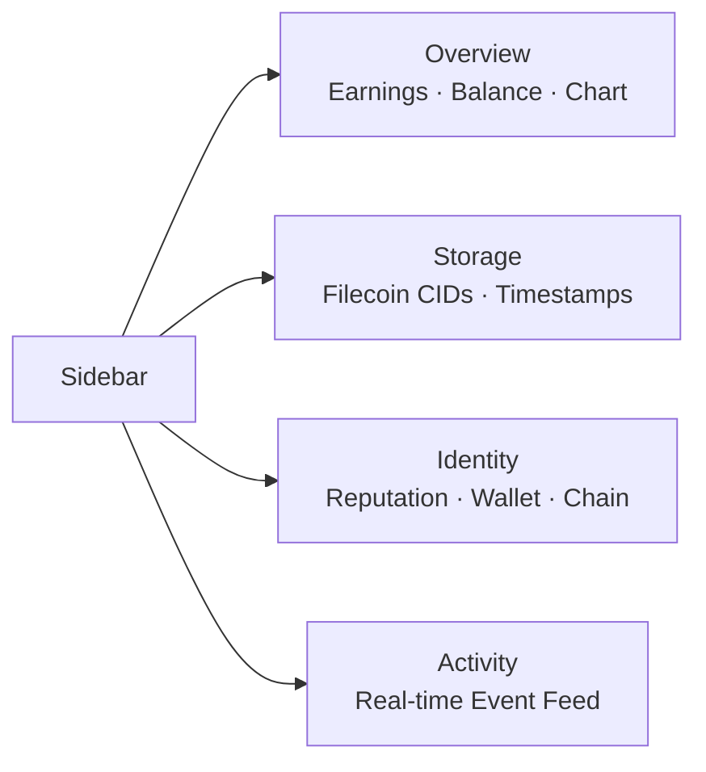
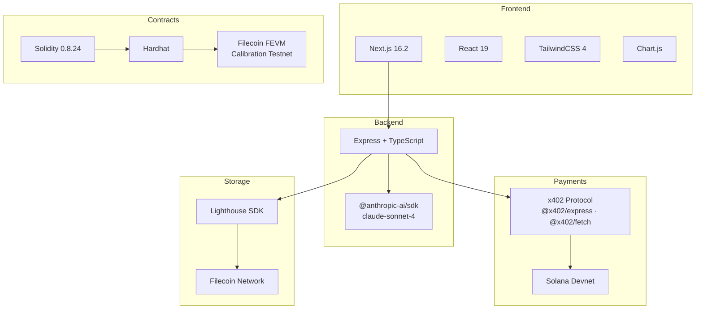

# Mint AI — Self-Sustaining AI Agents with x402 Payments & Filecoin Memory

> **Hackathon submission targeting Bounty 4 (x402 Micropayments) + Bounty 5 (Filecoin Infrastructure)**

Mint AI is a full-stack system that enables AI agents to **earn money autonomously**, **persist their memory** on decentralized storage, and **maintain verifiable on-chain identity** — all without a central operator.

---

## System Architecture



---

## Payment Flow



---

## Memory Persistence Flow



---

## Components

### 1. Agent Server (`agent-server/`)

An Express.js server offering Claude-powered AI services behind x402 payment gates.

**Paid Endpoints:**

| Endpoint | Price | Description |
|----------|-------|-------------|
| `GET /api/analyze?query=<text>` | $0.01 USDC | Deep analysis via Claude |
| `GET /api/generate?prompt=<text>` | $0.005 USDC | Content generation via Claude |
| `GET /api/predict?topic=<text>` | $0.02 USDC | Market prediction & trend analysis |

**Free Endpoints:**

| Endpoint | Description |
|----------|-------------|
| `GET /api/status` | Agent name, wallet, earnings, uptime |
| `GET /api/storage/memories` | List all memory batch CIDs on Filecoin |
| `GET /api/storage/memory/:cid` | Retrieve a specific memory batch |
| `GET /api/storage/identity` | Agent's on-chain identity data |
| `POST /api/storage/flush` | Manually flush memory buffer to Filecoin |

---

### 2. Smart Contract (`contracts/`)

**`AgentIdentityRegistry.sol`** — deployed on Filecoin FEVM Calibration Testnet (Chain ID: 314159)



---

### 3. Dashboard (`dashboard/`)



---

## Technology Stack



---

## Setup & Running

### Prerequisites
- Node.js 20+
- Solana wallet with Devnet SOL
- Filecoin Calibration testnet wallet with tFIL
- Anthropic API key
- Lighthouse API key

### 1. Deploy the smart contract

```bash
cd contracts
cp .env.example .env        # fill in PRIVATE_KEY (Filecoin wallet)
npm install
npm run compile
npm run deploy              # outputs: REGISTRY_CONTRACT_ADDRESS
```

### 2. Start the agent server

```bash
cd agent-server
cp .env.example .env        # fill in all keys + REGISTRY_CONTRACT_ADDRESS
npm install
npm run dev                 # http://localhost:4021
```

Required environment variables:
```
SVM_ADDRESS=<solana-public-key>
SVM_PRIVATE_KEY=<solana-private-key-base58>
ANTHROPIC_API_KEY=<key>
LIGHTHOUSE_API_KEY=<key>
FEVM_RPC_URL=https://api.calibration.node.glif.io/rpc/v1
FEVM_PRIVATE_KEY=<filecoin-wallet-private-key>
REGISTRY_CONTRACT_ADDRESS=<from-step-1>
FACILITATOR_URL=https://x402.org/facilitator
AGENT_NAME=MintAI-Alpha
PORT=4021
```

### 3. Run the consumer client

```bash
cd agent-client
cp .env.example .env        # fill in SVM_PRIVATE_KEY (different Solana wallet)
npm install
npm run consume             # calls 3 endpoints, auto-pays with x402
```

Total spend per demo run: `$0.035 USDC`

### 4. Start the dashboard

```bash
cd dashboard
npm install
npm run dev                 # http://localhost:3000
```

---

## Bounty Alignment

### Bounty 4 — x402 Micropayments
- `@x402/express` middleware gates three AI service endpoints
- `@x402/fetch` on the client automatically handles 402 → pay → retry
- Payments settle on Solana Devnet via the x402 facilitator at `x402.org`

### Bounty 5 — Filecoin Infrastructure
- Every agent request is eventually persisted to Filecoin via Lighthouse SDK
- Memory batches are addressable by CID from any Filecoin gateway
- `AgentIdentityRegistry` on Filecoin FEVM anchors each agent's memory index on-chain
- The `dataCID` field links on-chain records to off-chain Filecoin data — creating a verifiable, tamper-proof audit trail

---

## Networks

| Network | Purpose | Chain ID / RPC |
|---------|---------|----------------|
| Solana Devnet | x402 payment settlement | Devnet RPC |
| Filecoin FEVM Calibration | Smart contract deployment | 314159 / `api.calibration.node.glif.io` |
| Filecoin (via Lighthouse) | Agent memory storage | `gateway.lighthouse.storage` |

---

## Project Structure

```
PBC-Hackathon/
├── agent-server/          # Express + x402 + Claude + Lighthouse
│   └── src/
│       ├── index.ts       # Server entry point + routes
│       ├── config.ts      # Environment config
│       ├── agent/
│       │   ├── memory.ts  # Memory buffer + Filecoin flush
│       │   └── wallet.ts  # Earnings tracker
│       └── services/
│           ├── claude.ts  # Anthropic SDK wrapper
│           ├── storage.ts # Lighthouse SDK wrapper
│           └── identity.ts# Contract interaction
├── agent-client/          # x402 consumer demo
│   └── src/
│       ├── index.ts       # x402 client setup
│       └── consumer.ts    # Demo script
├── contracts/             # Solidity + Hardhat
│   ├── contracts/
│   │   └── AgentIdentityRegistry.sol
│   └── scripts/
│       └── deploy.ts
└── dashboard/             # Next.js monitoring UI
    └── app/
        ├── page.tsx           # Overview
        ├── storage/page.tsx   # Memory / Filecoin
        ├── identity/page.tsx  # On-chain reputation
        ├── activity/page.tsx  # Event feed
        └── components/
            └── Sidebar.tsx
```
